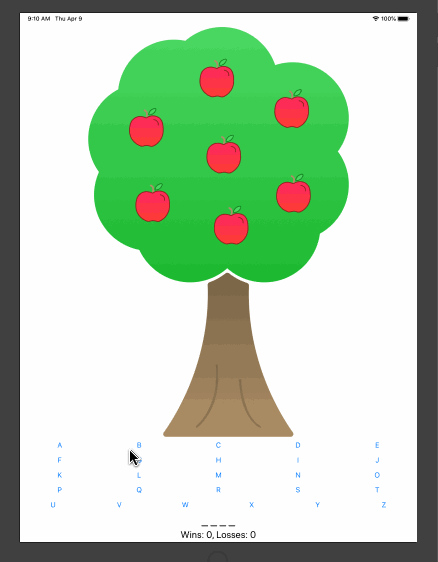

# Apple Pie

Apple Pie is a word-guessing game for the Apple iPad.

Submitted by: Raquel Santos

Time spent: 4 hrs

## User Stories

The following **required** functionality is complete:

* [x] Use stack views to design the layout.

* [x] Implement Auto Layout so app will work in both Landscape and Portrait mode.

* [x] Allow user to play multiple rounds until the game is won or lost.

The following **additional** features are implemented:

* [ ] Added a scoring feature that awards points for each correct guess and additional points for each successful word completion.

* [] Allow multiple players to play, switching turns after each incorrect guess.

* [ ] Allow the player to guess the full word using the keyboard instead of guessing one letter at a time using the interface buttons.

* [ ] Support letters with special characters. For example, the E button could check for "e" and "é" within a word.

* [x] List anything else that you can get done to improve the app functionality!

## Video Walkthrough 

Here's a walkthrough of implemented user stories:

## Notes

The main challenge was trying to find where everything is located in xcode. I'm kinda new to this and have not used xcode before. Another challenge I had was making sure each button was connected to the code to make it run properly. It was a tideous task, but I managed to get it done.

## License

Copyright 2020 Raquel Santos

Licensed under the Apache License, Version 2.0 (the "License");
you may not use this file except in compliance with the License.
You may obtain a copy of the License at

http://www.apache.org/licenses/LICENSE-2.0

Unless required by applicable law or agreed to in writing, software
distributed under the License is distributed on an "AS IS" BASIS,
WITHOUT WARRANTIES OR CONDITIONS OF ANY KIND, either express or implied.
See the License for the specific language governing permissions and
limitations under the License.
